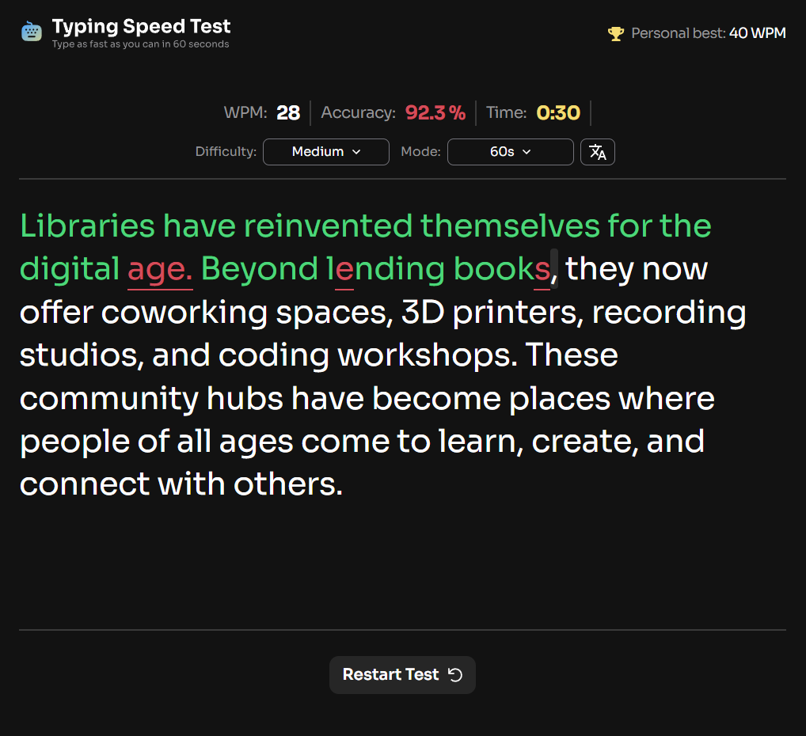
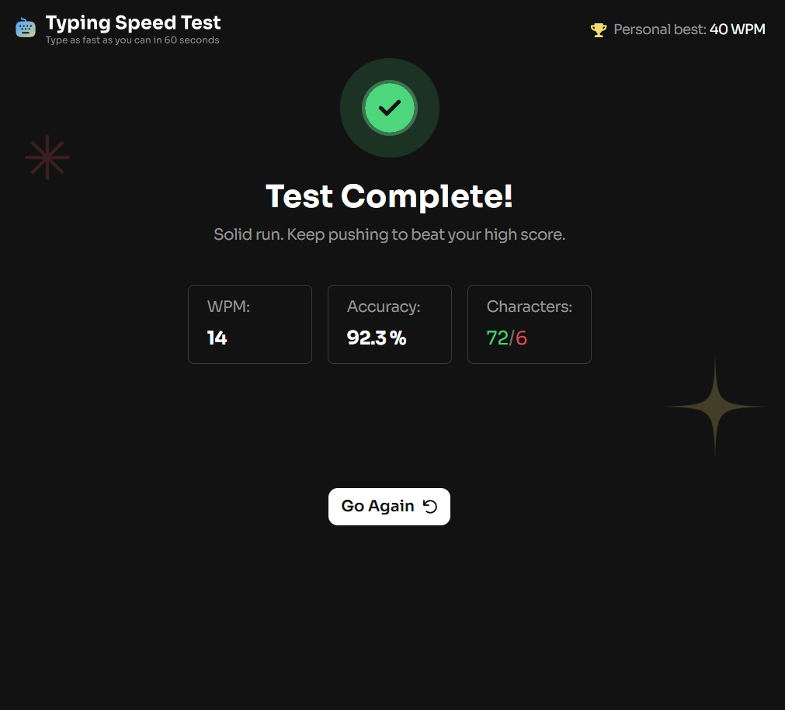

# Typing speed test

## A typing test app that tracks WPM, accuracy across multiple difficulty and time modes, with persistent user preferences.

- 🔗Live Demo: https://typing-speed-fm.onrender.com
- 📦Repository: https://github.com/Friendlesso/Typing-Speed-FM

## The Challenge

Build a typing speed test that calculates words per minute (WPM) and accuracy.

## Screenshots

#### Home Page


#### Results Page


## Features

### Core
 - Start a test by clicking **Start typing test** or by typing directly
 - Multiple **difficulty** and **time modes**
 - Display real-time **WPM** and **accuracy** and **remaining time**
 - Provide visual feedback:
  - Correct characters highlighted in green
  - Incorrect characters highlighted in red and underlined
  - Visible typing cursor
 - Show end-of-test results including WPM, accuracy, and correct incorrect character count
 - Track personal best using `localStorage`, with a visual celebration when a new high score is achived

### Enhancments
  - Persisted user preferences (difficulty, time, language)
  - UI animations and visual feedback
  - Multi-language typing support, including English, Spanish, and French test passages

## Tech Stack
  - React + TypeScript
  - Tailwind CSS
  - Vite

## Tehnical Decisions

 - **Centralized state managment in `App.tsx`**
  All typing stats, user preferences, test state, and completion tracking are managed in the root component to avoid unnecessary prop drilling across pages, components.
  → [./src/App.tsx](./src/App.tsx)
  
 - **Persistent user preferences with `localStorage`**
  Difficulty, language, time mode, personal best, and completion are stored and retrived from `localStorage` to maintain state across sessions without a backend.
  → [./src/App.tsx](./src/App.tsx)

 - **Derived typing statistics**
  WPM and accuracy are calculated dynamically based on `totalChar`, `incorrectChar` and elapsed time, instead of duplicating state. this ensures accurate real-time updates without stale data.
  → [getWPM()](./src/utils/getWPM.ts);
  → [getAccuracy()](./src/utils/getAccuracy.ts);

 - **Dynamic test generation based on language and difficulty**
  `getRandomTest` is used whenever the user changes difficulty or language, allowing multi-language typing test (English, Spanish, French) and difficulty-specific content.

 - **Visual feedback and user celebration**
  Correct and incorrect characters are visually distinguished, and new personal trigger a confetti animation using `canvas-confetti`, Improving UX without complicating core logic.
  →[Confetti Canvas](./src/pages/ResultPage/)

 - **keyboard-focused UX with automatic input focus**
  The typing input is auto-focused when a test starts, and users can start tests by typing or clicking the Start button, streamlining interaction.
  
## Setup

1. Clone the repo
```bash
git clone https://github.com/Friendlesso/Typing-Speed-FM
```
2. Install dependencies
```bash
npm i
```
3. Start the development server and open in browser
```bash
npm run dev
```

## Acknowlegements
 - This project was inspider by and based on a challenge from **[Frontend Mentor](https://www.frontendmentor.io/)**.
 - Thanks to Frontend Mentor for providing design inspiration and test cases.

## Author 
**Mihailo** - Developer

  - GitHub [Friendlesso](https://github.com/Friendlesso)
  - Portfolio: [](https://portfolio-miahilo.vercel.app/)
  - Frontend Mentor: [Mihailo](https://www.frontendmentor.io/profile/Friendlesso)
  - Emial: mihailoless@gmail.com
